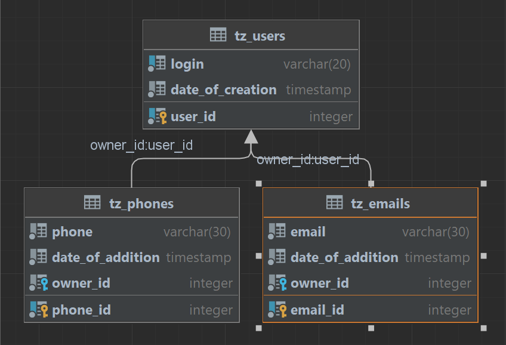

# UserAPI-TZ

## DB Diagram:



## Начало работы
1. Следуйте этим шагам для запуска проекта:
```
    git clone git@github.com:N0vaT/UserAPI-TZ.git
```
```
    cd UserAPI-TZ
```

2. Соберите и запустите Docker-контейнеры:
```
    docker-compose up -d
```

3. Дождитесь развертывания приложения в контейнерах


4. После успешного развертывания, вы сможете получить доступ к приложению по следующим адресам:
```
    http://localhost:8090/...
```
### Users:

| URI                          | HTTP Method | Description              |
|------------------------------|-------------|--------------------------|
| /user-api/v1/users           | GET         | Get all users            
| /user-api/v1/users/{userId}  | GET         | Get user by Id           
| /user-api/v1/users           | POST        | Create new user          
| /user-api/v1/users/{userId}   | PATCH       | Edit not null filds user 
| /user-api/v1/users/{userId}   | PUT         | Edit user                
| /user-api/v1/users/{userId}   | DELETE      | Delete user              

---

### Contacts:
#### Emails:
| URI                                               | HTTP Method | Description              |
|---------------------------------------------------|-------------|--------------------------|
| /user-api/v1/users/{userId}/emails                | GET         | Get all emails            
| /user-api/v1/users/{userId}/emails/{contactId}    | GET         | Get email by Id           
| /user-api/v1/users/{userId}/emails                | POST        | Create new email          
| /user-api/v1/users/{userId}/emails/{contactId}    | PATCH       | Edit not null filds email 
| /user-api/v1/users/{userId}/emails/{contactId}    | PUT         | Edit email                
| /user-api/v1/users/{userId}/emails/{contactId}    | DELETE      | Delete email              

#### Phones:

| URI                                            | HTTP Method | Description              |
|------------------------------------------------|-------------|--------------------------|
| /user-api/v1/users/{userId}/phones             | GET         | Get all phones            
| /user-api/v1/users/{userId}/phones/{contactId} | GET         | Get phone by Id           
| /user-api/v1/users/{userId}/phones             | POST        | Create new phone          
| /user-api/v1/users/{userId}/phones/{contactId} | PATCH       | Edit not null filds phone 
| /user-api/v1/users/{userId}/phones/{contactId} | PUT         | Edit phone                
| /user-api/v1/users/{userId}/phones/{contactId} | DELETE      | Delete phone              

---
